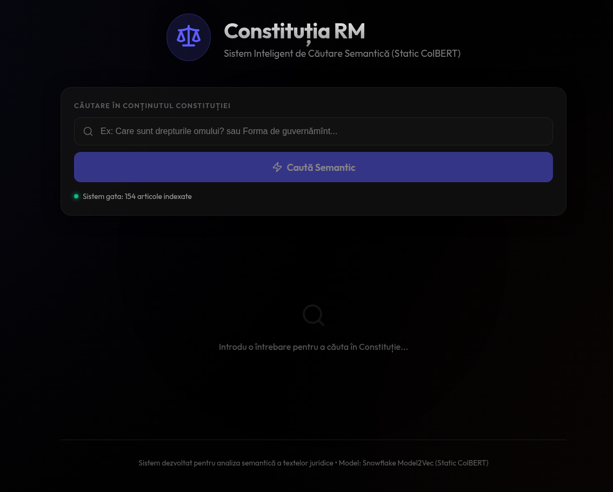
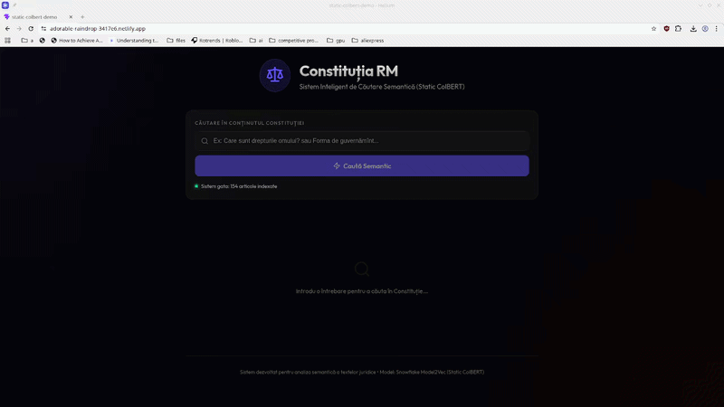

# Static ColBERT

## 1. Scopul Proiectului
Acest proiect rezolvă problema căutării rapide de informații în documente PDF de mari dimensiuni, chiar și pe dispozitive cu resurse limitate (cum ar fi direct în browser, folosind tehnologia WASM). Soluția noastră folosește un sistem de căutare semantică, bazat pe un model de *static embedding* compact și pe formula de calcul a similarității MaxSim, o abordare eficientă inspirată din arhitectura ColBERT. Acesta nu folosește rețele neuronale complexe la momentul interogării, ci se bazează pe reprezentări vectoriale pre-calculate, ceea ce reduce drastic latența și consumul de memorie.

## 2. Datele Utilizate
*   **Surse de date:** Pentru a demonstra practic funcționalitatea aplicației, folosim textul **Constituției Republicii Moldova**. Pentru a evalua riguros performanța modelului, utilizăm setul de date standardizat HotpotQA.
*   **Etică și intimitate:** Datele folosite sunt publice. Mai mult, datorită rulării locale direct în browser, interogările utilizatorilor rămân 100% private.
*   **Pregătirea datelor:** Textul documentelor este curățat de elemente inutile și împărțit în fragmente (*chunks*) de dimensiuni optime pentru a fi procesate de modelul de *embedding*. Pentru testarea în limba română, am tradus setul de date HotpotQA din engleză folosind modelul de limbaj (LLM) open-source Gemma 4.

## 3. Tehnologia și Arhitectura Modelelor
Pentru a face modelul de inteligență artificială suficient de mic și rapid, am aplicat o tehnică numită *distilare*, folosind librăria `model2vec`. Aceasta ne-a permis să transformăm un model complex (dens) într-un model mult mai eficient (*static embedding*). După ce am testat mai multe modele, am ales `snowflake/snowflake-arctic-embed-l-v2.0` datorită rezultatelor sale superioare.

Avantajele arhitecturii noastre:
1.  **Precizie ridicată la nivel de cuvânt:** Algoritmul MaxSim (inspirat de abordarea ColBERT) ne permite să comparăm detaliat cuvintele din întrebare cu cele din document (*token level*), rezultând o potrivire mult mai exactă comparativ cu metodele tradiționale.
2.  **Înțelegerea contextului extins:** Spre deosebire de modelele standard care comprimă o întreagă propoziție într-un singur vector, algoritmul MaxSim gestionează mult mai bine blocurile mari de text (*propoziții sau paragrafe*), fără a pierde detalii importante.
3.  **Eficiență:** Prin combinarea distilării cu formula de calcul MaxSim, reușim să obținem rezultate excelente de căutare, depășind alte modele similare de dimensiuni reduse.

**Resurse modele:**
*   Modelul de bază: [Snowflake Arctic Embed](https://huggingface.co/Snowflake/snowflake-arctic-embed-l-v2.0)
*   Modele de referință (pentru comparație):
    *   [Static Similarity MRL (Multilingual)](https://huggingface.co/sentence-transformers/static-similarity-mrl-multilingual-v1)
    *   [Potion Multilingual 128M](https://huggingface.co/minishlab/potion-multilingual-128M)

## 4. Evaluarea Performanțelor
Pentru a demonstra eficiența soluției, am testat modelul nostru distilat utilizând teste de performanță (*benchmark-uri*) standard, precum **NanoBEIR**, axându-ne în special pe scorul obținut pe setul de date **HotpotQA**:

| Metoda   | Limba | Model                                           | Scor |
|----------|-------|-------------------------------------------------|---------------|
| Cosine Similarity | ENG | sentence-transformers/static-similarity-mrl-multilingual-v1 | 0.5319        |
| Cosine Similarity | ENG | minishlab/potion-multilingual-128M             | 0.4570        |
| Cosine Similarity | ENG | Model distilat                                        | 0.4566        |
| Cosine Similarity | RO  | sentence-transformers/static-similarity-mrl-multilingual-v1 | 0.4931        |
| Cosine Similarity | RO  | minishlab/potion-multilingual-128M             | 0.4615        |
| Cosine Similarity | RO  | Model distilat                                        | 0.3672        |
| MaxSim   | ENG | sentence-transformers/static-similarity-mrl-multilingual-v1 | 0.5600        |
| MaxSim   | ENG | minishlab/potion-multilingual-128M             | 0.5995        |
| MaxSim   | ENG | Model distilat                                        | 0.6196        |
| MaxSim   | RO  | sentence-transformers/static-similarity-mrl-multilingual-v1 | 0.3979        |
| MaxSim   | RO  | minishlab/potion-multilingual-128M             | 0.4663        |
| MaxSim   | RO  | Model distilat                                        | 0.4608        |

**Concluzia Evaluării:** 
Utilizând abordarea noastră cu algoritmul MaxSim și reducerea dimensionalității la **256 PCA**, modelul nostru distilat obține scoruri excelente de regăsire a informației (**0.619** pentru engleză, **0.460** pentru română). Prin comparație, modelele care utilizează o abordare simplă de *Cosine Similarity* obțin scoruri vizibil mai mici. De asemenea, modelul nostru rivalizează direct cu cele mai bune modele de tip *static embedding* disponibile, dar cu un avantaj major: **dimensiunea sa este de doar 124 MB**, fiind mult mai compact decât alternativele precum `potion-multilingual-128M` (512 MB) sau `static-similarity-mrl-multilingual-v1` (434 MB).

## 5. Structura Proiectului și Rularea Aplicației
Proiectul este împărțit în componente clare, folosind tehnologii specifice:

### A. Distilarea Modelului (`notebooks/model2vec_distill.ipynb`)
Am folosit libraria `model2vec[distill]` pentru a obtine un model de *static embedding*.

### B. Evaluarea Performanțelor (`notebooks/eval_hotpotqa_*.ipynb`)
Aici am evaluat performanța modelului nostru folosind setul de date HotpotQA. Am comparat abordarea noastră cu abordări tradiționale, cum ar fi *Cosine Similarity*.

### C. Aplicația Web Demo (`src/`)
Interfața demonstrativă este găzduită online prin **Netlify** și permite căutarea semantică prin articolele **Constituției Republicii Moldova**. Modelul rulează direct în browser prin intermediul tehnologiei WASM, garantând confidențialitatea totală a căutărilor, fără a trimite date spre un server extern.
*   **Tehnologii utilizate:**
    *   **React** și **Vite** pentru dezvoltarea rapidă a interfeței web.
    *   `@huggingface/transformers` pentru a rula modelul AI direct în JavaScript/WASM.
    *   `framer-motion` pentru o interfață dinamică și animații fluide.
    *   `lucide-react` pentru iconografii.

Pentru a rula local aplicația web demonstrativă:
1.  Instalați pachetele necesare: `npm install`
2.  Porniți serverul de testare: `npm run dev`

Un demo live este disponibil la https://adorable-raindrop-3417e6.netlify.app

## 6. Prezentare Vizuală

Imagini din demo:

## 7. Beneficii Potențiale

* **Costuri de Infrastructură Zero**: Sistemul rulează integral pe dispozitivul utilizatorului (client-side), eliminând nevoia de servere scumpe cu GPU sau API-uri AI plătite.

* **Confidențialitate Absolută (Privacy by Design)**: Datele și interogările nu părăsesc niciodată browserul. Este soluția ideală pentru documente sensibile (juridice, medicale) și conformitate GDPR.

* **Latență Ultra-Scăzută**: Eliminarea timpului de rețea permite rezultate instantanee pe măsură ce utilizatorul tastează.

* **Funcționare Offline**: Aplicația rămâne funcțională fără conexiune la internet, fiind utilă pentru echipe de teren sau biblioteci digitale portabile.

* **Scalabilitate Infinită**: Puterea de procesare este distribuită la nivelul fiecărui client, astfel încât sistemul nu poate fi suprasolicitat de un număr mare de utilizatori.

## 8. Dezvoltări Viitoare
Pentru a îmbunătăți și mai mult aplicația, planificăm următoarele direcții:
1.  **Eficiență sporită a memoriei:** Dorim să folosim un *tokenizer* (modulul care împarte textul în "cuvinte" pentru model) personalizat, cu un vocabular mai mic și adaptat limbii române, pentru a reduce și mai mult consumul de memorie (RAM) în timpul rulării.
2.  **Modele și mai compacte:** Vom experimenta cu adăugarea unui strat suplimentar (*projection layer*) pentru a tăia din dimensiunile vectorilor generați, încercând să păstrăm precizia la fel de ridicată.

## 9. Concluzii
Proiectul dovedește că, prin aplicarea tehnicilor de distilare a modelelor AI și folosind metode avansate de calcul al similarității (precum MaxSim), putem crea sisteme de căutare semantică extrem de rapide și eficiente. Aceste sisteme pot funcționa excelent chiar și pe calculatoare obișnuite sau telefoane mobile, oferind în același timp un nivel maxim de confidențialitate și respectând normele etice.

---

### Structura Fișierelor:
*   `/src`: Codul sursă al aplicației web (React + Vite).
*   `/data`: Locația în care sunt stocate datele folosite pentru evaluarea modelului (hotpotqa)
*   `/notebooks`: Locația în care sunt stocate notebook-urile Jupyter utilizate pentru procesul de evaluare a performanței modelului și procesul de distilare a modelului.
*   `/models`: Locația în care este stocat modelul distilat.
*   `/public`: Locația în care sunt stocate documentele principale folosite pentru demonstrația de căutare.
